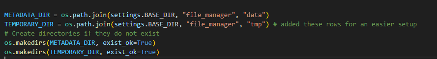
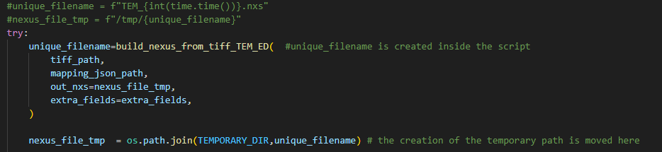

##  Description

This project aims to make **LAME** (Lightweight API for Metadata Extraction) as **flexible and adaptable** as possible to different infrastructures and research workflows. To achieve this, a **minimally invasive approach** was adopted, allowing for progressive and modular integration with existing systems.

Please note that the version uploaded to this repository **differs slightly** from the one described in the thesis, as the projects have **evolved together over time** to meet new requirements and technical improvements.

## ️ Files Description

The `code/` folder contains all the relevant scripts, configuration files, and example data used for generating NeXus files from microscopy outputs.

- `Au_np_2ev_00.tif`, `Au_np_2ev_01.tif`, `Au_np_2ev_02.tif`: Example output images acquired from the microscope.
- `dati.txt`: A text file containing recurring experimental values that are not embedded in the image metadata and not provided via the GUI form.
- `nexus_integration.py`: The main Python script to be modified. It includes the logic and utilities for generating the final NeXus `.h5` file.
- `NXem.nxdl.xml`: The official NeXus XML definition for electron microscopy, from which unnecessary sections have been removed for our purposes.
- `NXem.nxdl.json`: A simplified JSON version of the XML above, representing the cleaned structure used in our workflow.
- `NXem_def.nxdl.json`: The JSON file where metadata keys are mapped to values for NeXus file generation.

##  Project Structure

```
code/
├── Au_np_2ev_00.tif
├── Au_np_2ev_01.tif
├── Au_np_2ev_02.tif
├── dati.txt
├── nexus_integration.py
├── NXem.nxdl.xml
├── NXem.nxdl.json
└── NXem_def.nxdl.json
```

## ⚙ Minimal Changes to Original Project

To follow the principle of minimal invasiveness, only a few essential modifications were made to the original LAME project's `views.py` file. These changes simplify local deployment and improve portability, without altering the core architecture of the system.

### ✅ Directory Creation Logic

The following lines were added to automatically create the `TEMPORARY_DIR` and `METADATA_DIR` directories if they do not already exist:



---

### ✅ Output File Path Assignment

Another small change involved moving the logic that generates the output path `nexus_file_tmp`, because the `unique_filename` is now created **inside** the `build_nexus_from_tiff_TEM_ED()` function. This makes the code more modular and reduces side effects:



---

A discussion with the original maintainers is planned to evaluate the inclusion of these improvements in the upstream repository.


## 🧩 Function Descriptions of nexus_integration.py

This section describes the core functions in `nexus_integration.py` and their roles in the NeXus file generation process.

### `print_dictionary(dizionario)`
Recursively prints the contents of a dictionary in a human-readable format. Useful for debugging deeply nested dictionaries.

### `metadata_extractor_tiff(tiff_path)`
Extracts metadata from a TIFF file and returns it as a dictionary. Handles various formats such as datetime, numpy arrays, and byte strings.

### `extract_fields(element, path="")`
Recursively parses an XML NeXus schema element, extracting all `field`, `group`, and `attribute` definitions along with their paths and types.

### `create_schema_from_xml(xml_path)`
Parses an XML schema file and saves its structure as a JSON file. Returns the parsed schema as a list of field definitions.

### `load_json(json_path)`
Loads a JSON file from disk and returns its parsed content as a Python object.

### `get_or_create_group(root, path_parts)`
Navigates or creates groups in an HDF5 file based on the provided path parts. Ensures that all intermediate groups exist.

### `insert_metadati(metadata_path, metadati)`
Determines the correct value to insert in the NeXus file based on the metadata mapping path. Handles direct string values, links, and embedded expressions.

### `build_nexus_from_tiff_TEM_ED(tiff_path, mapping_json_path, out_nxs, extra_fields)`
Main function to generate a NeXus `.nxs` file:
- Loads external metadata from `dati.txt`
- Extracts and merges metadata from TIFF files
- Loads the metadata schema mapping
- Builds the NeXus file using `h5py`, inserting datasets and attributes accordingly
- Handles both static fields and per-image event data groups
- Returns the name of the generated file
