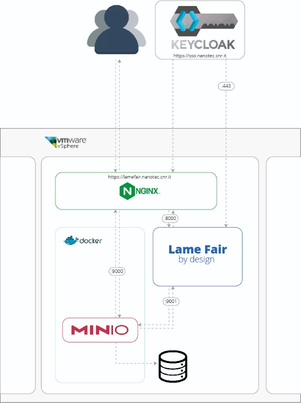
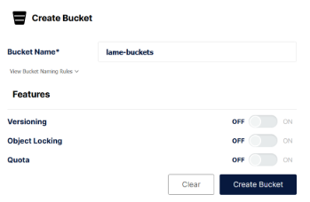
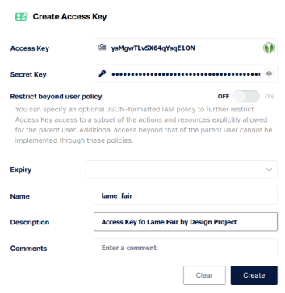
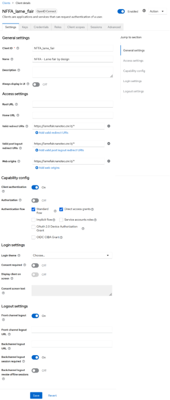
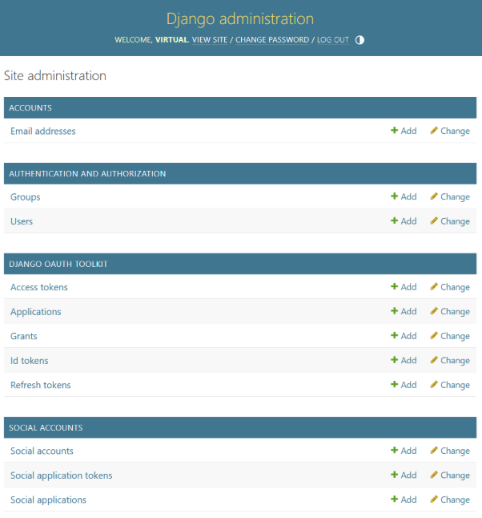
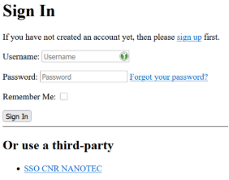

## Configuration and Integration

The main package of Lame Fair was configured to operate on the virtualized replica (digital twin) of 
the VirtualOrfeo HPC cluster. This provides a sandbox environment where users can safely perform development tests on the normal workflow of the HPC system.

However, substantial differences in the software architectures used immediately emerged.

|**Technologies**|**Main Package**|**CNR NANOTEC Lecce**|
| :-: | :-: | :-: |
|Virtualization|KVW / QEMU / Libvirt|Vsphere / VCenter|
|Containerization environment|Kubernetes|Docker / Podman|
|Workload manager|Slurm|PCB|
|Federated Authentication|FreeIPA / Authentik|Keycloak|
|Storage|MinIO|Isilon|
||||

In this regard, before we could proceed with the development and the software, it was necessary to harmonize the entire ecosystem underlying the file\_manager.



## Operational Phases
### Virtualization: VM Setup
A Linux development virtual machine with Ubuntu 24.04 was created on 
the vSphere orchestrator, equipped with 4 cores, 
8 GB of RAM and 259 GB of storage and connected to an internal network protected by VPN. 

This was necessary to create the first test environment, 
in which all the components could communicate with each other.

### Container: Docker Setup
Given the high compatibility with Kubernetes and the availability of configuration scripts in YAML in the guide; it was enough to install docker and docker compose. This system allows you to run applications in isolated environments called containers that represent a real extension of the operating system.
Now we install docker, taking care to install all the prerequisites:
```
# add the official Docker GPG key

sudo apt-get update
sudo apt-get install ca-certificates curl
sudo install -m 0755 -d /etc/apt/keyrings
sudo curl -fsSL https://download.docker.com/linux/ubuntu/gpg -o /etc/apt/keyrings/docker.asc
sudo chmod a+r /etc/apt/keyrings/docker.asc

# add the repository to the apt sources
echo \
  "deb [arch=$(dpkg --print-architecture) signed-by=/etc/apt/keyrings/docker.asc] https://download.docker.com/linux/ubuntu \
  $(. /etc/os-release && echo "${UBUNTU_CODENAME:-$VERSION_CODENAME}") stable" | \
  sudo tee /etc/apt/sources.list.d/docker.list > /dev/null

sudo apt-get update

# install docker
sudo apt-get install docker-ce docker-ce-cli containerd.io docker-buildx-plugin docker-compose-plugin

# Check the installed version
docker --version
docker compose version

```

### Storage: MinIO Setup
In this case we cannot use the YAML file already available on main repository of lame fair project, 
in our case a local configuration is sufficient, 
because we will later expose the service port (API on 9001) using Nginx.

```
mkdir ~/minio
mkdir ~/minio/data

sudo docker run \
   -p 9000:9000 \
   -p 9001:9001 \
   --name minio \
   -v ~/minio/data:/data \
   -e "MINIO_ROOT_USER=<minio_admin>" \
   -e "MINIO_ROOT_PASSWORD=<password_minio_admin>" \
   quay.io/minio/minio server /data --console-address ":9001"

```

Now we can create a bucket that the application can use to save the files to analyze. 
To do this, it is also necessary to generate credentials to allow lame fair 
to access the storage using the APIs that MinIO provides.

### Creating a bucket
From the VM we access via browser to the web interface address: http://localhost:9000 
by entering the credentials provided during installation.
*Buckets -> Create Bucket -> lame-bucket*



### Creating a set of credentials (API keys)
I create access credentials, which I will use in the future to allow lame_fair to connect to storage.
*Access Keys -> Create Access Key*



N.B. At this stage I do not provide an expiration date for the credentials.

### OpenID Connect: Keycloak client configuration
Required to allow the application to authenticate through the Single Sign-On of CNR NANOTEC Lecce.
Selecting the *Realm -> Clients -> Create client*


Now we have a client with which we can proceed, in a secure manner, to the authentication of users, 
using the endpoints present in the manifest:
*.well-known/openid-configuration*
and made available by Keycloak for the OIDC protocol.

### Certificates
I copy the certificates provided for FreeIPA to a local folder and save its location 
in an environment variable.

```
sudo cp freeipa-lame.crt /usr/local/share/ca-certificates/freeipa-lame.crt
sudo update-ca-certificates
export REQUESTS_CA_BUNDLE=/usr/local/share/ca-certificates/freeipa-lame.crt
```
I insert the certificate of the subdomain lamefair.nanotec.cnr.it in the user's home, 
that is: ~/lamefair_nanotec_cnr_it.csr


### Web Server: Nginx Setup
At the user's discretion, it can be installed directly on the VM or in a container.
We use it to manage the internal routing of the newly configured services, 
by modifying the configuration file.

#### SSL by default
We set a redirect to port 443 for all incoming connections from port 80.

```
server {
    if ($host = lamefair.nanotec.cnr.it) {
        return 301 https://$host$request_uri;
    } 

    listen 80;
    listen [::]:80;

    server_name lamefair.nanotec.cnr.it;
    return 301 https://lamefair.nanotec.cnr.it$request_uri;

}
```

#### Proxy setup
Let's now set up the internal routing to the lame_dair_by_design application 
which we will expose on port 8000.

```
server {

        listen 443 ssl;
        listen [::]:443;
        server_name lamefair.nanotec.cnr.it;
        ssl on;
        ssl_certificate /etc/letsencrypt/live/localhost/fullchain.pem;
        ssl_certificate_key /etc/letsencrypt/live/localhost/privkey.pem;

        ssl_protocols TLSv1.2 TLSv1.3;
        ssl_ciphers HIGH:!aNULL:!MD5;

        ## OCSP Stapling
        resolver <VM_PUBLIC_IP_ADDRESS>;
        ssl_stapling on;
        ssl_stapling_verify on;
        ssl_trusted_certificate /home/test/lamefair_nanotec_cnr_it_cert.cer;

        root /var/www/html;

        # Add index.php to the list if you are using PHP
        index index.html index.htm index.nginx-debian.html;

        location / {
        
                # redirect all traffic to localhost:8000;
                proxy_set_header Host $http_host;
                proxy_set_header X-Real-IP $remote_addr;
                proxy_set_header X-Forwarded-For $proxy_add_x_forwarded_for;
                proxy_set_header X-NginX-Proxy true;
                proxy_set_header X-Forwarded-Proto $scheme;

                proxy_pass http://<VM_LOCAL_IP_ADDRESS>:8000/;
                proxy_redirect off;
                proxy_read_timeout 86400;

                # enables WS support
                proxy_http_version 1.1;
                proxy_set_header Upgrade $http_upgrade;
                proxy_set_header Connection "upgrade";

                # prevents 502 bad gateway error
                proxy_buffers 8 32k;
                proxy_buffer_size 64k;

                reset_timedout_connection on;

                tcp_nodelay on;
        }
}
```

### Lame_fair_by_design
Now that the authentication and storage management ecosystem are up and running, 
it is finally possible to create the python virtual environment by installing 
the requirements in the *requirementx.txt* file


#### Download the project
I download the lame_fair_by_design project from the official git, 
used by our community to upload the different versions and track the changes made to the code. 
It is very likely that following the configuration we are seeing, 
a fork could be born with the same engine, but predisposed to the technological ecosystem 
that revolves around the CNR NANOTEC institute in Lecce.
```
git clone https://gitlab.com/area7/nffa-di/lame_fair_by_design.git
cd lame_fair_by_design
git switch feature/virtualorfeo_integration

```

#### Creating the virtual environment in python
Let's now proceed with the creation of the virtual environment and the installation 
of all the libraries necessary for the operation of lame_fair_by_design.
```
python -m venv venv

source venv/bin/activate

pip install -r requirements.txt
```


#### Installing additional packages
Additional packages have also been installed to interface Keycloak to the Django authentication module, 
but as we will see they are not strictly necessary, 
because the packages needed to use OpenID Connect are already installed.

```
django-allauth==65.2.0
django-oauth-toolkit==3.0.1
oauthlib==3.2.2
datapunt-keycloak-oidc==0.5.1   # -> Optional
```

### .env file configuration
We will now enter all the connection parameters produced.

#### MinIO
I insert here the IP address of the machine on which MinIO is installed, 
(in this case it will correspond to the IP of the current machine). 
It is important not to use the IPs 127.0.0.1 or localhost, 
since with Nginx access to resources occurs from the outside. 
Therefore, the resolution task is delegated to the DNS.

```
MINIO_ENDPOINT_URL="http://<IP_VM>:9000"
MINIO_ACCESS_KEY="<ACCESS_KEY_BUCKET>"
MINIO_SECRET_KEY="<SECRET_KEY_BUCKET>"
MINIO_BUCKET_NAME="lame-bucket"

AWS_S3_USE_SSL=False
AWS_S3_VERIFY=False
```

#### OIDC Sectrets
I enter my Keycloak client credentials here
```
OIDC_RP_CLIENT_ID=NFFA_lame_fair
OIDC_RP_CLIENT_SECRET=<KEYCLOAK_CLIENT_SECRET>

OIDC_RP_SCOPES=openid email profile
OIDC_RP_SIGN_ALGO=RS256
OIDC_VERIFY_SSL=True
```

#### OIDC endpoint
I enter the provided addresses into Keycloak's *.well-known/openid-configuration*.
```
OIDC_OP_AUTHORIZATION_ENDPOINT=https://sso.nanotec.cnr.it/realms/nanotec.cnr.it/protocol/openid-connect/auth
OIDC_OP_TOKEN_ENDPOINT=https://sso.nanotec.cnr.it/realms/nanotec.cnr.it/protocol/openid-connect/token
OIDC_OP_USER_ENDPOINT=https://sso.nanotec.cnr.it/realms/nanotec.cnr.it/protocol/openid-connect/userinfo
OIDC_OP_JWKS_ENDPOINT=https://sso.nanotec.cnr.it/realms/nanotec.cnr.it/protocol/openid-connect/certs
OIDC_OP_LOGOUT_ENDPOINT=https://sso.nanotec.cnr.it/realms/nanotec.cnr.it/protocol/openid-connect/logout
```

#### OIDC login/logout redirect
I insert the login and logout pages of lame_fair_by_design after 
successful authentication on Keycloak or logout.
```
OIDC_LOGIN_URL=https://lamefair.nanotec.cnr.it/accounts/login
OIDC_LOGIN_REDIRECT_URL=https://lamefair.nanotec.cnr.it/
OIDC_LOGOUT_REDIRECT_URL=https://lamefair.nanotec.cnr.it/accounts/login
```

#### OIDC Certificates
I insert the subdomain certificate.
```
OIDC_REQUESTS_VERIFY_CERT_PATH=/home/test/lamefair_nanotec_cnr_it.csr
```


#### Configuring MiniIO Settings
We will now insert the significant lines for the correct functioning of MinIO with Keycloak.
```
...
DEBUG = config('DJANGO_DEBUG', default=True, cast=bool)
...
#ALLOWED_HOSTS = os.getenv('DJANGO_ALLOWED_HOSTS', '').split(',')
ALLOWED_HOSTS = ['*']
...
INSTALLED_APPS = [
    'django.contrib.admin',
    'django.contrib.auth',
    'django.contrib.contenttypes',
    'django.contrib.sessions',
    'django.contrib.messages',
    'django.contrib.staticfiles',
    'oauth2_provider',
    'allauth',
    'allauth.account',
    'allauth.socialaccount',
    'allauth.socialaccount.providers.openid_connect',
    'storages',
    'file_manager',
]

AUTHENTICATION_BACKENDS = [
    'django.contrib.auth.backends.ModelBackend',
    'allauth.account.auth_backends.AuthenticationBackend',
]

MIDDLEWARE = [
    'django.middleware.security.SecurityMiddleware',
    'django.contrib.sessions.middleware.SessionMiddleware',
    'django.middleware.common.CommonMiddleware',
    'django.middleware.csrf.CsrfViewMiddleware',
    'django.contrib.auth.middleware.AuthenticationMiddleware',
    'django.contrib.messages.middleware.MessageMiddleware',
    'django.middleware.clickjacking.XFrameOptionsMiddleware',
    'allauth.account.middleware.AccountMiddleware',
]


ROOT_URLCONF = 'minio_app.urls'

TEMPLATES = [
    {
        'BACKEND': 'django.template.backends.django.DjangoTemplates',
        'DIRS': [],
        'APP_DIRS': True,
        'OPTIONS': {
            'context_processors': [
                'django.template.context_processors.debug',
                'django.template.context_processors.request',
                'django.contrib.auth.context_processors.auth',
                'django.contrib.messages.context_processors.messages',
            ],
        },
    },
]
...

SOCIALACCOUNT_PROVIDERS = {
    "openid_connect": {
        "APPS": [
            {
                "provider_id": "sso.nanotec.cnr.it",
                "name": "SSO CNR NANOTEC",
                "client_id": "NFFA_lame_fair",
                "secret": "Xm1pQpXEXY23ZesSNGXL5J8Zp9blmlx9",
                "settings": {
                    "server_url": "https://sso.nanotec.cnr.it/realms/nanotec.cnr.it/.well-known/openid-configuration",
                "token_auth_method": "password",
                },
            }
        ]
    }
} ...
```

### Launch application
Taking care to work inside the virtual environment of python, 
we will now apply the changes made and install additional packages mentioned above in django. 
If the update is successful, we will start the application on port 8000, as set by the proxy.

```
python3 manage.py migrate
python3 manage.py runserver <LOCAL_IP_ADDRESS>:8000
```

#### Login
There are now two different login areas, one for the administrative part of Django, 
from which you can create other administrators and an operational one.

Administrator login url: https://lamefair.nanotec.cnr.it/admin




Standard user login URL: https://lamefair.nanotec.cnr.it/accounts/login




